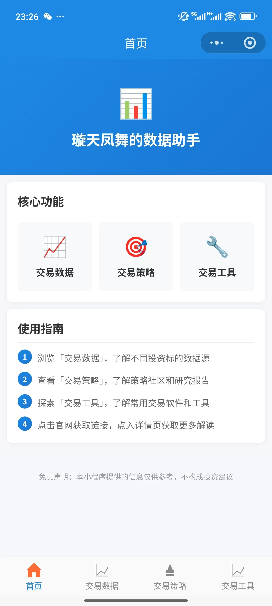
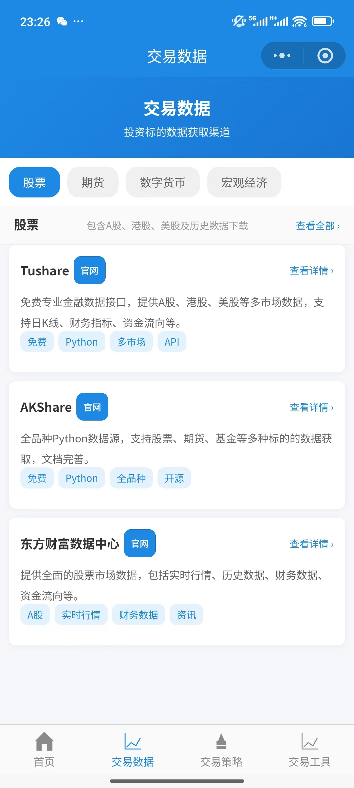
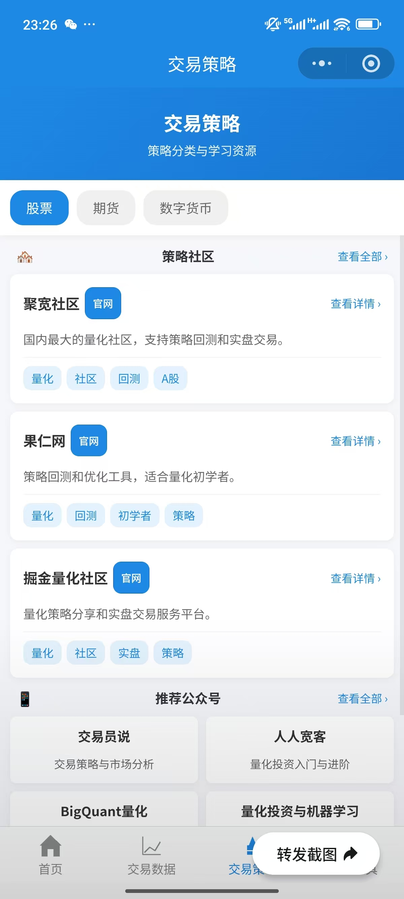
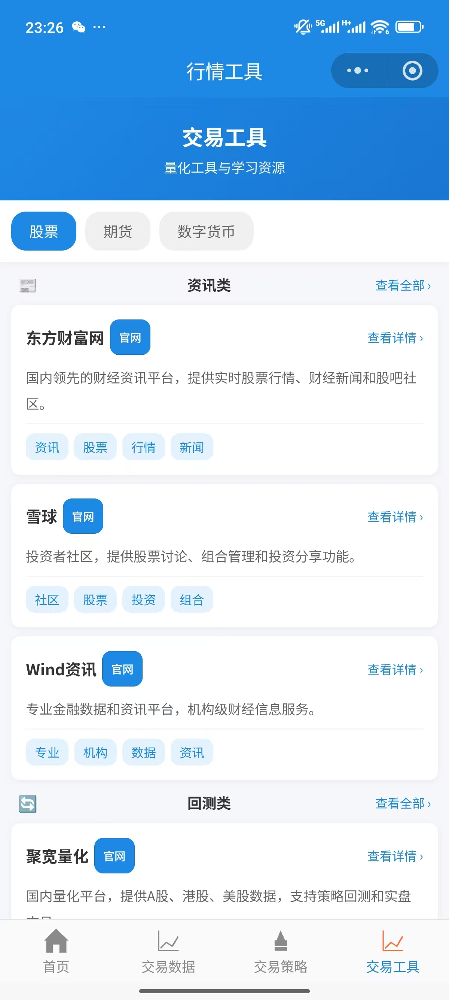

# 璇天凤舞的数据助手

一个面向二级市场投资者的专业工具类微信小程序，提供交易数据、交易策略、交易工具等一站式服务。

## 功能特点

- 📊 **交易数据**：股票、期货、外汇、数字货币、宏观经济等多品类数据获取渠道介绍
- 🎯 **交易策略**：策略社区、推荐公众号、券商研究报告等策略资源汇总
- 🛠️ **交易工具**：资讯平台、回测框架、交易软件等工具推荐

## 技术架构

- **前端框架**：原生微信小程序
- **数据存储**：腾讯云COS（对象存储）
- **更新机制**：动态加载JSON配置文件，无需重新发布即可更新内容

## 页面结构

```
├── 首页              # 产品介绍与功能导航
├── 交易数据          # 数据获取渠道介绍
│   ├── 股票
│   ├── 期货
│   ├── 外汇
│   ├── 数字货币
│   └── 宏观经济
├── 交易策略          # 策略分类与研究报告
│   ├── 股票
│   ├── 期货
│   ├── 外汇
│   └── 数字货币
├── 交易工具          # 工具推荐与介绍
│   ├── 股票
│   ├── 期货
│   ├── 外汇
│   └── 数字货币
└── 详情页            # 各项目详细介绍
```

## 数据管理

### 文件结构

```
data/
├── trading_data/     # 交易数据模块
│   ├── categories.json
│   └── details/
├── trading_strategy/ # 交易策略模块
│   ├── categories.json
│   └── details/
└── trading_tools/    # 交易工具模块
    ├── categories.json
    └── details/
```

### 更新方式

1. 修改 `data/` 文件夹下的 JSON 文件
2. 上传至腾讯云COS对应路径
3. 用户下次访问自动获取最新数据

## 小程序截图

### 首页



### 交易数据页面



### 交易策略页面



### 交易工具页面



## 开发说明

### 开发环境

- 微信开发者工具
- Node.js 环境

### 运行项目

1. 打开微信开发者工具
2. 导入项目目录（选择 `native/` 文件夹）
3. 点击「编译」按钮

### 发布流程

1. 在微信开发者工具中点击「上传」
2. 登录微信公众平台提交审核
3. 审核通过后发布上线

## 配置说明

### COS配置

在 `native/pages/detail/detail.js` 和 `native/pages/common/list.js` 中配置COS地址：

```javascript
const COS_BASE_URL = 'https://your-bucket.cos.region.myqcloud.com/data';
```

### 合法域名

在微信公众平台配置服务器域名：

- `https://your-bucket.cos.region.myqcloud.com`

## 联系方式

如有问题或建议，欢迎联系开发者。

***

**版本**：v1.0.0\
**更新日期**：2026年5月7日
